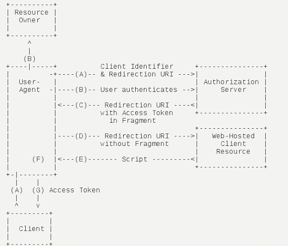

简化模式：implicit grant type
---

简化模式（implicit grant type）不通过第三方应用程序的服务器，直接在浏览器中向认证服务器申请令牌，跳过了"授权码"这个步骤，因此得名。所有步骤在浏览器中完成，令牌对访问者是可见的，且客户端不需要认证。



它的步骤如下：
> （A）客户端将用户导向认证服务器。
> （B）用户决定是否给于客户端授权。
> （C）假设用户给予授权，认证服务器将用户导向客户端指定的"重定向URI"，并在URI的Hash部分包含了访问令牌。
> （D）浏览器向资源服务器发出请求，其中不包括上一步收到的Hash值。
> （E）资源服务器返回一个网页，其中包含的代码可以获取Hash值中的令牌。
> （F）浏览器执行上一步获得的脚本，提取出令牌。
> （G）浏览器将令牌发给客户端。

下面是上面这些步骤所需要的参数。A步骤中，客户端发出的HTTP请求，包含以下参数：
* response_type：表示授权类型，此处的值固定为"token"，必选项。
* client_id：表示客户端的ID，必选项。
* redirect_uri：表示重定向的URI，可选项。
* scope：表示权限范围，可选项。
* state：表示客户端的当前状态，可以指定任意值，认证服务器会原封不动地返回这个值。

下面是一个例子。
```
    GET /authorize?response_type=code&client_id=clientapp&state=xyz&redirect_uri=http://client.com/callback HTTP/1.1
    Host: server.example.com
```    

C步骤中，认证服务器回应客户端的URI，包含以下参数：
* access_token：表示访问令牌，必选项。
* token_type：表示令牌类型，该值大小写不敏感，必选项。
* expires_in：表示过期时间，单位为秒。如果省略该参数，必须其他方式设置过期时间。
* scope：表示权限范围，如果与客户端申请的范围一致，此项可省略。
* state：如果客户端的请求中包含这个参数，认证服务器的回应也必须一模一样包含这个参数。

下面是一个例子。
```
     HTTP/1.1 302 Found
     Location: http://example.com/cb#access_token=2YotnFZFEjr1zCsicMWpAA&state=xyz&token_type=example&expires_in=3600
```
在上面的例子中，认证服务器用HTTP头信息的Location栏，指定浏览器重定向的网址。注意，在这个网址的Hash部分包含了令牌。

根据上面的D步骤，下一步浏览器会访问Location指定的网址，但是Hash部分不会发送。接下来的E步骤，服务提供商的资源服务器发送过来的代码，会提取出Hash中的令牌。


# 实际应用

1. 启动项目，在浏览器输入下面链接：
```
http://localhost:8080/oauth/authorize?response_type=token&state=xyz&client_id=clientapp&redirect_uri=http://m.client.com/callback
```

输入用户名密码（密码要求是123456）。用户登录成功后，会跳到授权页面，同意授权之后重定向redirect_uri，获取access_token。
```
http://m.client.com/callback#access_token=03c74c87-1ce9-408a-a896-8e6a66863c53&state=xyz&token_type=bearer&expires_in=299&scope=read_profile%20read_contacts
```